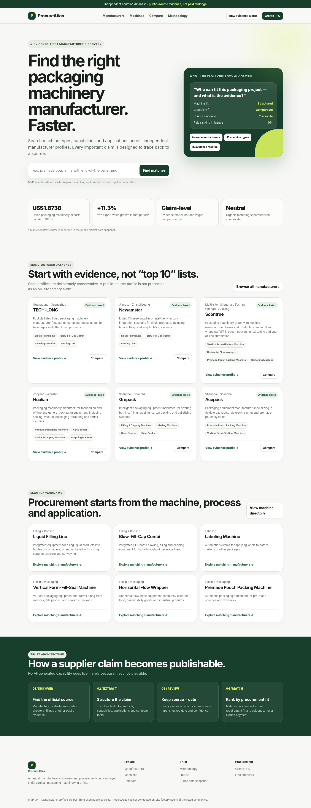

# ProcureAtlas

**Evidence-first manufacturer discovery and procurement decision platform.**  
Initial vertical: **packaging machinery manufacturers in China** for international B2B buyers.

This repository is intentionally independent. It is not designed to promote, seed, rank, or route procurement leads toward any business owned by the project sponsor.

## Preview



## What v0.1 already does

- Generates a zero-backend SEO-friendly static website from structured JSON.
- Ships with 8 independent public-source manufacturer seed profiles.
- Models 15 packaging machine types and 17 procurement capabilities.
- Keeps source URL, source type, review date and confidence on evidence records.
- Manufacturer search by text, machine and region.
- Product-to-manufacturer pages.
- Browser-side manufacturer comparison for 2–4 companies.
- RFQ workflow preview without pretending a production backend exists.
- Exposes `llms.txt`, `robots.txt`, `sitemap.xml`, JSON data snapshots and JSON-LD.
- Deploys directly to **GitHub Pages** using GitHub Actions.
- Includes a Phase-2 Supabase schema without requiring Supabase for the MVP.

## Why the first vertical is packaging machinery

The selection was made on procurement economics rather than familiarity with any sponsor business:

- high-value B2B equipment and strong RFQ intent;
- product and process capabilities can be structured;
- many manufacturers expose technical material publicly;
- the buying decision benefits from machine/capability comparison;
- China has substantial packaging-machinery export activity.

The market context snapshot lives in `data/market.json` so the rationale is auditable and replaceable.

## Run locally

No Node packages or build framework are required for v0.1.

```bash
python scripts/validate_data.py
python scripts/build.py
python -m http.server 8000 -d site
```

Open `http://localhost:8000`.

## Deploy to GitHub Pages

1. Create a GitHub repository, e.g. `procure-atlas`.
2. Push this repository to the `main` branch.
3. In **Settings → Pages**, select **GitHub Actions** as the Pages source if GitHub has not already enabled it.
4. The included `.github/workflows/pages.yml` validates data, builds the static site and deploys it.
5. Default URL: `https://<github-user>.github.io/<repo-name>/`.

The workflow supplies the real GitHub Pages URL to the generator so `canonical`, sitemap and `llms.txt` are generated correctly.

## Repository structure

```text
.
├── data/                    # source-of-truth catalogue and evidence snapshot
├── scripts/
│   ├── validate_data.py     # relational/data integrity checks
│   └── build.py             # zero-dependency static generator
├── site/                    # generated GitHub Pages output
├── supabase/
│   └── schema.sql           # Phase-2 operational database schema
├── .github/workflows/
│   └── pages.yml            # GitHub Pages CI/CD
├── PROJECT_DECISIONS.md     # non-negotiable product rules
└── README.md
```

## Evidence rules

A manufacturer appearing on the site does **not** mean ProcureAtlas has audited its factory.

Current statuses distinguish:

- public-source profile;
- claim/source confidence;
- separate factory-audit status.

The production database is designed to move from manufacturer-level evidence to **claim-level evidence mapping**, where each capability assertion links to exact supporting source records.

## Ranking rules

Organic matching must never silently include payment as a ranking signal. Future sponsored placements must be visibly labeled and separated from procurement-fit scores.

## Phase 2

After the static publishing system is stable:

1. Move operational catalogue and review workflow into Supabase/Postgres.
2. Build data-review/admin console.
3. Add protected RFQ submission via an Edge Function with bot protection and rate limiting.
4. Map every manufacturer-product/capability relation to claim-level evidence.
5. Add deterministic matching score before any LLM explanation layer.
6. Add AI requirement parsing only through a server-side function; never expose provider keys in GitHub Pages JavaScript.
7. Generate versioned public snapshots from approved database records for GitHub Pages SEO pages.

## Data maintenance

Before accepting a new manufacturer:

```text
Discover → Official source → Extract → Normalize → De-duplicate → Evidence review → Publish → Re-check
```

No missing capability should be inferred as false. In comparison tables, `—` means “not recorded in this snapshot.”

## License / commercial use

No open-source license has been granted in this repository. Treat the code and dataset as **all rights reserved** until the project owner deliberately chooses a license.
